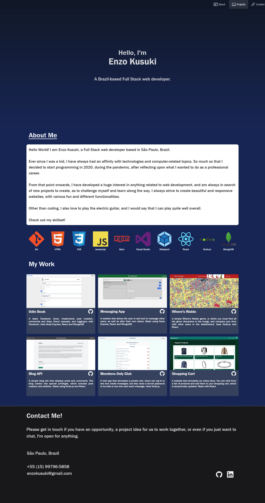

# Personal Portfolio

This is my personal portfolio website. It showcases some of my own projects as well as my abilities in HTML and CSS. I took my time to make the design unique and beautiful, as well as trying out new techniques, especially in CSS.

Overall, I am feeling much more confortable working on the front-end of web development. Starting this project out, I wasn't sure how the design was going to be, so I played around with my introduction and some animations at first, and then moved on to the other sections individually, following the initial design and color palette. I developed this site with the 'mobile-first' approach in mind, which was definitively an interesting experience, and it guarantees that it is responsive for every device.

After finishing the layout, adding content and fixing some issues on larger screens, I moved on to some animations and used Javascript to make them work when they should.

In the end, I'm pretty proud of how this site turned, as it served as a very rich learning experience for me. This project will definitively get some updates as I learn new things and create more impressive projects on my web development journey.

The most recent update (Version 1.1) has completely remastered this project from the ground up, upgrading it to React and adding other improvements in layout.

Version 1.1 changelog:
* Updated the project to use React
* Added more icons as part of my 'skillset'
* Changed the projects showcased under 'My Work' and their descriptions
* Made the page text bigger overall
* Upscaled the 'Contact Me' section
* Changed the 'About Me' section paragraph by adding a white box behind the text
* Improved mobile device compatibilitiy
* Header is now fixed at the top of the page